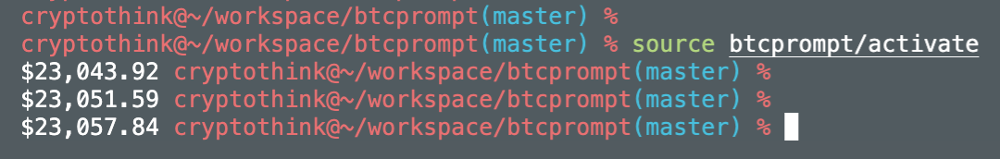

# btcprompt

show BTC price in the prompt, your terminal should be like this




1. git clone to your local

2. `cd` into project, run the server end in the background

```shell
pip3 install -r requirements.txt

nohup python3 -m btcprompt.run  > /dev/null 2>&1 &
```

3. activate your prompt config

```shell
source btcprompt/activate
```

4. deactivate it if you want

```shell
deactivate
```

Note: query BTC price from `https://www.coingecko.com/en/coins/bitcoin`, and set every 30 secs query once.